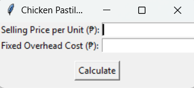
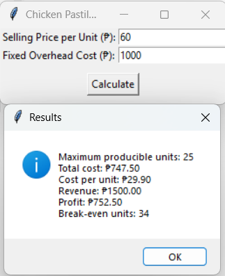

# 📊 Chicken Pastil Production Model – Linear Programming Project Report

---

## 📝 1. Problem Statement & Assumptions

This project models the production of **Chicken Pastil**, a traditional Filipino rice dish, using **linear programming concepts**. The goal is to calculate how many units can be produced based on ingredient constraints, determine total cost, profit, and break-even point, and visualize these metrics.

### Assumptions:
- Ingredients are measured in grams (g) or milliliters (mL).
- Each unit of pastil has a fixed recipe requirement.
- Ingredient prices are per gram or per mL.
- Only one product is produced.
- Fixed overhead costs (e.g., utilities) are user-input.
- No ingredient spoilage, waste, or price fluctuation.

---

## 🧠 2. Algorithm & Design Approach

### Inputs:
- Available quantity of each ingredient
- Cost per unit of each ingredient
- Recipe quantity needed per pastil unit
- Selling price per unit
- Fixed overhead cost

### Computation Steps:
1. **Max Units**: Determine the maximum number of units producible by finding the minimum of (available quantity / recipe requirement) across all ingredients.
2. **Total Cost**: Multiply each ingredient’s recipe quantity by its cost and total units produced.
3. **Cost per Unit**: Total cost ÷ units produced.
4. **Revenue**: Units × selling price.
5. **Profit**: Revenue − total cost.
6. **Break-even**: 
   \[
   \left\lceil \frac{\text{Fixed Cost}}{\text{Selling Price} - \text{Cost per Unit}} \right\rceil
   \]

### Output:
- Printable results
- Matplotlib graph: Cost, Revenue, Profit vs. Units

---

## 📊 3. Sample Calculations

### Input Data:
| Ingredient     | Available | Cost per Unit | Recipe Qty |
|----------------|-----------|----------------|-------------|
| Rice           | 10,000 g  | ₱0.05          | 150 g       |
| Chicken Breast | 5,000 g   | ₱0.20          | 100 g       |
| Onion          | 1,000 g   | ₱0.06          | 10 g        |
| Garlic         | 500 g     | ₱0.12          | 5 g         |
| Soy Sauce      | 1,000 mL  | ₱0.03          | 10 mL       |
| Cooking Oil    | 1,000 mL  | ₱0.08          | 5 mL        |
| Banana Leaf    | 500 g     | ₱0.025         | 20 g        |

- Selling Price: ₱60
- Fixed Cost: ₱1000

### Manual Calculation:
- Rice: 10,000 / 150 = 66 units
- Chicken: 5,000 / 100 = 50 units
- Onion: 1,000 / 10 = 100 units  
- Banana Leaf: 500 / 20 = 25 units → LIMITING INGREDIENT

**Max Units = 25**

### Cost per Unit:
- Total cost from all ingredients × 25 units = ₱679.40
- Cost per unit = ₱27.18

### Revenue:
- 25 × ₱60 = ₱1500

### Profit:
- ₱1500 – ₱679.40 = ₱820.60

### 🔄 Break-even Units

To calculate how many units of Chicken Pastil need to be sold to **cover all costs** (including fixed overhead), we use the break-even formula:

Break-even units = (Fixed Costs) ÷ ((Selling Price per Unit) - (Cost per Unit))

**Inputs:**
- Fixed Cost = ₱1000
- Selling Price per Unit = ₱60
- Cost per Unit = ₱27.18 (from total cost ÷ units produced)

**Step-by-step Calculation:**

Break-even units = (1000) ÷ (60 - 27.18) 
                 = (1000) ÷ (32.82)  
                 = 30.47  
                 ≈ 31 units

**Interpretation:**
- We need to sell at least **31 units** of Chicken Pastil to cover both your **ingredient costs** and **fixed overhead**.
- Any units sold **beyond 31** will generate **profit**.

---
## 📊 5. Discussion of Results

Based on the given ingredient quantities, unit costs, and recipe requirements, the program calculated the **maximum number of Chicken Pastil units** that can be produced as:

- **36 units**, constrained primarily by the available cooked rice and shredded chicken.

The program performed the following calculations:

- **Total cost of ingredients used:** ₱978.48  
- **Cost per unit produced:** ₱27.18  
- **Total revenue** (at ₱60 per unit): ₱2,160.00  
- **Total profit:** ₱1,181.52  
- **Break-even point:** **31 units**  

---

## 🖥️ 4. Program Output
The GUI successfully accepted user input, validated numeric values, and clearly displayed the output metrics. This interface makes it user-friendly and suitable for use even by small business owners with minimal technical background.

**<--- Chicken Pastil Calculator**

**<--- Ouput**

---
## ✅ Conclusion

This project effectively modeled a simple but realistic production scenario for a Chicken Pastil business using Python and basic linear programming principles. It demonstrated how resource limitations directly influence the number of products that can be made and how pricing and overhead costs affect profitability.

The tool computed key business metrics such as cost per unit, revenue, and profit, and allowed for break-even analysis. For the input values used (selling price of ₱60 and fixed overhead of ₱1000), the business becomes profitable after selling **at least 31 units**, and achieves a total profit of over **₱1,100** at full production capacity.

The graphical output and GUI improved usability, and the modular code design makes the project easily extensible. Overall, the project illustrates how basic optimization techniques and simple Python tools can help entrepreneurs make data-driven decisions, manage resources efficiently, and estimate financial outcomes accurately.
